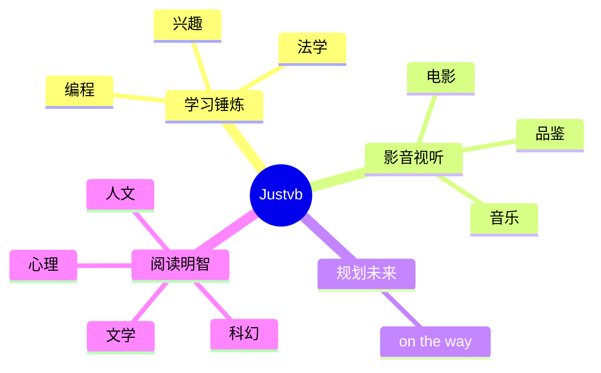

  
  <!-- dynamic typing effect 动态打字效果 -->
  

    
  

  <!-- knock code pictures 敲代码的图片 -->
   

  <!-- profile logo 个人资料徽标 -->
  

    &emsp;
    &emsp;
     <!-- visitor statistics logo 访客数统计徽标 -->
    
   
   <!-- 
    &emsp;
    &emsp;
    &emsp;
    &emsp;
    &emsp;
    &emsp;
    &emsp;
    -->
    
  

#  😎 Hello

<!-- ########################################## 分割 ########################################## -->

  
<!-- Quotes 名人名言 -->
 
  
 

    
  
<!-- GitHub 奖杯🏆 -->
# 🏆GitHub Profile Trophy
 

# 🍂GitHub stats🍃
    
<!-- github-readme-streak-stats 连续提交代码天数记录 -->
&emsp;

<!-- GitHub 数据统计 -->

  

<!-- GitHub Activity Graph GitHub 活动图 -->
<table align="center">
  <tr>
    <td></td>
  </tr>
</table>

<!-- ########################################## 分割 ########################################## -->

