```mermaid
mindmap
  root((Justvb))
    学习锤炼
      编程
      法学
      兴趣
    影音视听
      电影
      品鉴
      音乐
    规划未来
      on the way
    阅读明智
      科幻
      人文
      文学
      心理
      
```
  
  <!-- dynamic typing effect 动态打字效果 -->
  

    
  

  <!-- knock code pictures 敲代码的图片 -->
   

  <!-- profile logo 个人资料徽标 -->
  

    &emsp;
    &emsp;
    
   <!-- 
    &emsp;
    &emsp;
    &emsp;
    &emsp;
    &emsp;
    &emsp;
    &emsp;
    -->

    <!-- visitor statistics logo 访客数统计徽标 -->
    
  

  <!-- Snake Code Contribution Map 贪吃蛇代码贡献图 -->
  <picture>
  <source media="(prefers-color-scheme: dark)" srcset="https://cdn.jsdelivr.net/gh/Justvb/Justvb/profile-snake-contrib/github-contribution-grid-snake-dark.svg" />
  <source media="(prefers-color-scheme: light)" srcset="https://cdn.jsdelivr.net/gh/Justvb/Justvb/profile-snake-contrib/github-contribution-grid-snake.svg" />
  
  </picture>

#  🙋 Hello

<!-- ########################################## 分割 ########################################## -->

  
<!-- Quotes 名人名言 -->
 
  
<!-- GitHub 奖杯🏆 -->
 

<!-- GitHub 数据统计 -->

  

<!-- Awesome repo 比较好的仓库-->

  

<!-- github-readme-streak-stats 连续提交代码天数记录 -->
&emsp;

&emsp;

<!-- Spotify 音乐 -->
<!-- &emsp;&emsp;&emsp;&emsp;

  &emsp;&emsp;&emsp;&emsp; -->

<!-- metrics 基础资料 -->
&emsp;

&emsp;

<!-- My Blog 博客首页 -->
&emsp;

&emsp;

<!-- GitHub Activity Graph GitHub 活动图 -->
<table align="center">
  <tr>
    <td></td>
  </tr>
</table>

<!-- ########################################## 分割 ########################################## -->

<!-- GitHub metrics 信息指标 -->

<!-- just img 图片 -->

<!-- first form 第一个表格 -->
<table>
  <tr>
    <td></td>
  </tr>
</table>

<!-- second form 第二个表格 -->
<table>
  <tr>
    <td></td>
    <td></td>
  </tr>
  <tr>
    <td></td>
    <td></td>
  </tr>
  <tr>
    <td></td>
    <td></td>
  </tr>
  <tr>
    <td></td>
    <td></td>
  </tr>
  <tr>
    <td></td>
    <td></td>
  </tr>
  <tr>
    <td></td>
    <td></td>
  </tr>
  <tr>
    <td></td>
    <td></td>
  </tr>
</table>

<!-- just img 图片 -->

